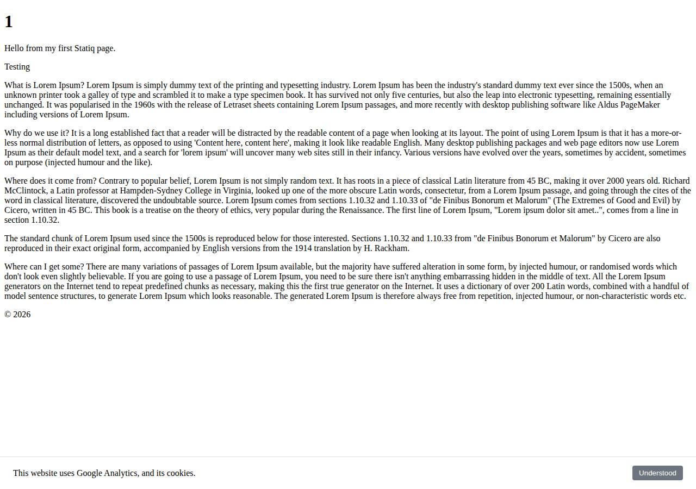
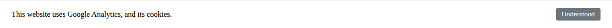

# Cookies Notice

A Statiq plugin that injects a dismissible cookie consent banner into rendered HTML pages.

Uses [madmurphy/cookies.js](https://github.com/madmurphy/cookies.js/) to read and write cookies.

## Screenshot





## Configuration

Add the following optional keys to your `appsettings.json`:

```json
{
  "CookiesNoticeName": "cookiesAccepted",
  "CookiesNoticeMessage": "This website uses Google Analytics, and its cookies.",
  "CookiesNoticeButtonText": "Understood"
}
```

| Key | Default | Description |
|-----|---------|-------------|
| `CookiesNoticeName` | `cookiesAccepted` | Name of the cookie set when the user dismisses the banner |
| `CookiesNoticeMessage` | `This website uses Google Analytics, and its cookies.` | Text shown in the banner |
| `CookiesNoticeButtonText` | `Understood` | Label on the dismiss button |

## How it works

1. `CookiesNoticeConfigurator` is auto-discovered by Statiq and adds `CookiesNoticeModule` to the `Content` pipeline's `PostProcessModules`.
2. `CookiesNoticeModule` processes every `.html` output file, loading the banner HTML/JS from an embedded resource and the styles from a separate embedded CSS resource.
3. The rendered banner is injected immediately before the closing `</body>` tag.
4. On page load the `cookies.js` library checks for the named cookie. If absent, the banner is shown. Clicking the button sets a non-expiring cookie and hides the banner.
